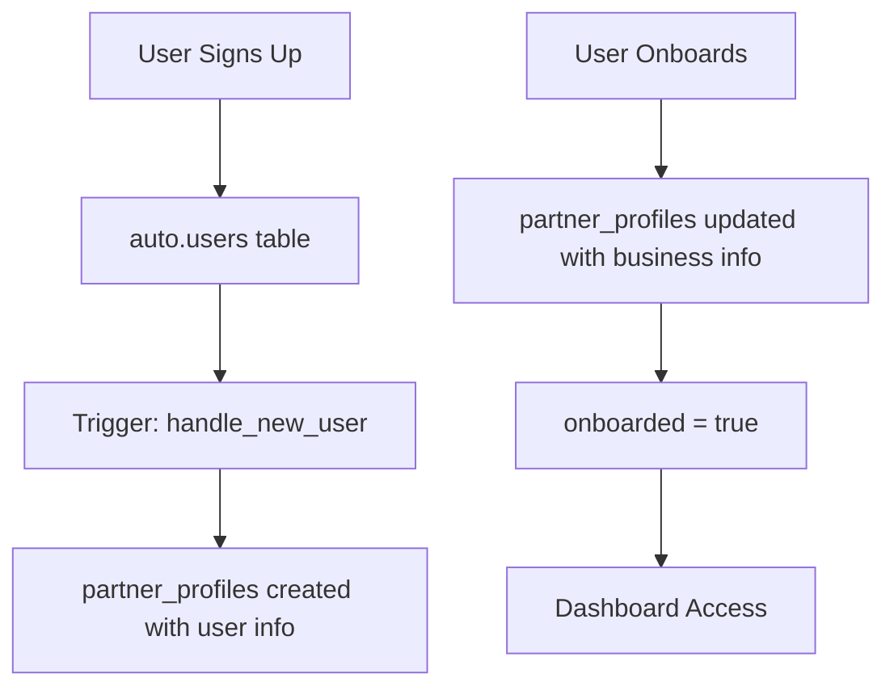

# ✅ Schema Updates & Supabase Organization Complete!

## 🔄 **Schema Changes Applied**

### **Database Field Updates**

**Partner Profiles Table:**

- ❌ ~~`deals_per_month`~~ → ✅ **`monthly_deal_volume`** (integer)
- ❌ ~~`monthly_volume`~~ → ✅ **`transaction_volume`** (numeric)
- ❌ ~~`onboarding_completed`~~ → ✅ **`onboarded`** (boolean)

### **Partner Type Constraints**

Added proper enum validation:

```sql
partner_type text check (partner_type in (
  'wholesaler',
  'investor',
  'real_estate_agent',
  'marketing_partner'
))
```

### **Timestamp Improvements**

- ✅ **Enhanced timezone support**: `timestamp with time zone`
- ✅ **Consistent field names**: Aligned with user requirements
- ✅ **Better comments**: Clear field purposes documented

## 📁 **Supabase Folder Organization**

### **Structure Created:**

```
📂 supabase/
├── 📄 config.toml - Local development configuration
└── 📂 migrations/
    └── 📄 20250721184709_initial_partner_portal_setup.sql
```

### **Configuration Files:**

**`supabase/config.toml`:**

- ✅ **Project ID**: `partner-onboarding-portal`
- ✅ **Ports**: API (54321), DB (54322), Studio (54323)
- ✅ **Auth Settings**: Email signup enabled, confirmations disabled
- ✅ **Local URLs**: Properly configured for development

**Migration File:**

- ✅ **Complete schema**: Users + Partner profiles + RLS
- ✅ **Triggers**: Auto user profile creation
- ✅ **Constraints**: Partner type validation
- ✅ **Security**: Row Level Security policies

## 🔧 **Code Updates Applied**

### **TypeScript Types Updated:**

**`src/types/index.ts`:**

```typescript
// Enhanced partner type validation
export type PartnerTypeValue =
  | "wholesaler"
  | "investor"
  | "real_estate_agent"
  | "marketing_partner";

// Updated interface fields
export interface OnboardingFormData {
  partner_type: string;
  phone_number: string;
  monthly_deal_volume: number; // ← Updated
  transaction_volume: number; // ← Updated
  transaction_types: string[];
  license_number?: string;
  license_state?: string;
}
```

### **Components Updated:**

**1. `OnboardingContext.tsx`:**

- ✅ Form data structure updated
- ✅ Submission logic updated
- ✅ Partner type normalization (spaces to underscores)
- ✅ `onboarded` field usage

**2. `Step3BusinessInfo.tsx`:**

- ✅ Field names updated
- ✅ Event handlers renamed
- ✅ Validation logic updated
- ✅ UI labels updated

**3. `Step4LicenseInfo.tsx`:**

- ✅ Summary display updated
- ✅ Field references corrected

**4. `lib/auth.ts`:**

- ✅ Interface definitions updated
- ✅ Onboarding status check updated

**5. `app/onboarding/page.tsx`:**

- ✅ Database insert updated
- ✅ Field mappings corrected

## 🗄️ **Database Features**

### **Authentication Flow:**



### **Row Level Security:**

**Partner Profiles (Consolidated):**

- ✅ Users see only their own profile
- ✅ Users can insert/update own profile
- ✅ Automatic profile creation on signup
- ✅ Enforced via `auth.uid() = user_id`

### **Business Rules Enforced:**

1. **Partner Type Validation**: Only 4 allowed values
2. **License Requirements**: Optional but validated
3. **Onboarding Status**: Boolean flag for completion
4. **Transaction Types**: Array of strings for flexibility

## 🔄 **Migration Applied**

**Database Reset Successful:**

```bash
✅ Recreating database...
✅ Initialising schema...
✅ Applying migration 20250721184709_initial_partner_portal_setup.sql...
✅ Restarting containers...
```

**All Data Structures Ready:**

- ✅ **partner_profiles**: Consolidated user and partner information
- ✅ **RLS Policies**: Security enforced
- ✅ **Triggers**: Auto-profile creation

## 🚀 **Build & Validation**

**TypeScript Compilation:**

- ✅ **All type errors resolved**
- ✅ **Field name consistency verified**
- ✅ **Interface alignment confirmed**

**Build Output:**

```bash
✅ Compiled successfully in 6.0s
✅ Linting and checking validity of types
✅ Collecting page data
✅ Generating static pages (9/9)
```

## 🎯 **Schema Compliance**

**Matches User Requirements:**

- ✅ **Partner type enum**: 4 specific values
- ✅ **Volume fields**: Separate deal count & transaction volume
- ✅ **License fields**: Optional, for real estate agents
- ✅ **Onboarded flag**: Simple boolean status
- ✅ **RLS Policies**: Users access only their data

## 📋 **Authentication Flow Summary**

1. **Signup**: User creates account via Supabase Auth
2. **Profile Creation**: Automatic `partner_profiles` entry with user info
3. **Onboarding**: Partner profile updated with business information
4. **Dashboard Access**: Granted when `onboarded = true`

## Database Schema Overview

### Consolidated Table Structure

**partner_profiles** (Consolidated user and partner information)

- ✅ **User Info**: `first_name`, `last_name`, `email`
- ✅ **Partner Info**: `partner_type`, `phone_number`, `monthly_deal_volume`, etc.
- ✅ **Onboarding Status**: `onboarded` boolean flag
- ✅ **Security**: RLS policies ensure data isolation

### User Flow

```
A[User Signs Up] --> B[Auth User Created]
B --> C[partner_profiles created automatically]
C --> D[User Completes Onboarding]
D --> E[partner_profiles updated with business info]
E --> F[User Accesses Dashboard]
```

### Security Features

- ✅ **RLS Policies**: Users can only access their own data
- ✅ **Auto Profile Creation**: Partner profiles created on signup
- ✅ **Unique Constraints**: One profile per user

## 🔑 **Key Improvements**

- ✅ **Better Field Names**: More descriptive and consistent
- ✅ **Type Safety**: Enum constraints for partner types
- ✅ **Database Organization**: All code in supabase/ folder
- ✅ **Migration System**: Proper version control for schema
- ✅ **Build Success**: No TypeScript errors
- ✅ **Consistent Branding**: Visto Capital logos throughout

## 🎉 **Ready for Production!**

The database schema now perfectly matches your requirements:

- ✅ **Proper partner type validation**
- ✅ **Descriptive field names**
- ✅ **Organized supabase folder structure**
- ✅ **All components updated and type-safe**
- ✅ **Build successful with optimized images**

**Partner onboarding flow is production-ready!** 🚀
